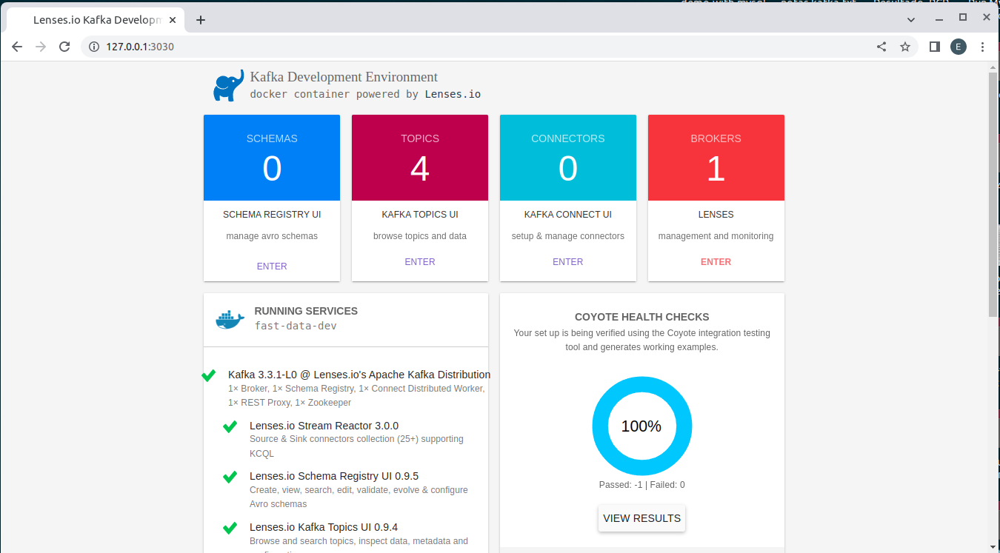

RUNNING KAFKA
---------------------------------------------------------------------

Running Kafka using docker image provided by Landoop.

```

https://hub.docker.com/r/landoop/fast-data-dev

```

This image provides a Kafka distribution with Apache Kafka, Kafka Connect, Zookeeper, Confluent Schema Registry and REST Proxy.

---------------------------------------------------------------------

**Docker Compose YAML file:**

```

version: '1'

services:
  kafka-cluster:
    image: landoop/fast-data-dev:latest
    environment:
      ADV_HOST: 127.0.0.1         # Change to 192.168.99.100 if using Docker Toolbox
      RUNTESTS: 0                 # Disable Running tests so the cluster starts faster
      FORWARDLOGS: 0              # Disable running 5 file source connectors that bring application logs into Kafka topics
      SAMPLEDATA: 0               # Do not create sea_vessel_position_reports, nyc_yellow_taxi_trip_data, reddit_posts topics with sample Avro records.
    ports:
      - 2181:2181                 # Zookeeper
      - 3030:3030                 # Landoop UI
      - 8081-8083:8081-8083       # REST Proxy, Schema Registry, Kafka Connect ports
      - 9581-9585:9581-9585       # JMX Ports
      - 9092:9092                 # Kafka Broker

```

---------------------------------------------------------------------

**Running with docker compose (using detached mode):**

```

docker-compose up -d

```

**When running command "docker ps" I get this:**


```

$docker ps

CONTAINER ID   IMAGE                          COMMAND                  CREATED          STATUS          PORTS                                                                                                                                                                                                                                                                     NAMES
265b6da0c3b4   landoop/fast-data-dev:latest   "/usr/bin/dumb-init …"   42 seconds ago   Up 41 seconds   0.0.0.0:2181->2181/tcp, :::2181->2181/tcp, 0.0.0.0:3030->3030/tcp, :::3030->3030/tcp, 0.0.0.0:8081-8083->8081-8083/tcp, :::8081-8083->8081-8083/tcp, 0.0.0.0:9092->9092/tcp, :::9092->9092/tcp, 0.0.0.0:9581-9585->9581-9585/tcp, :::9581-9585->9581-9585/tcp, 3031/tcp   kafka-confluent-2_kafka-cluster_1

```

**Checking logs from container with id 265b6da0c3b4:**

```

$docker logs 265b6da0c3b4

Setting advertised host to 127.0.0.1.
Starting services.
This is Lenses.io’s fast-data-dev. Kafka 3.3.1-L0 (Lenses.io's Kafka Distribution).
You may visit http://127.0.0.1:3030 in about a minute.
2023-01-28 05:04:57,400 INFO Included extra file "/etc/supervisord.d/01-zookeeper.conf" during parsing
2023-01-28 05:04:57,400 INFO Included extra file "/etc/supervisord.d/02-broker.conf" during parsing
2023-01-28 05:04:57,400 INFO Included extra file "/etc/supervisord.d/03-schema-registry.conf" during parsing
2023-01-28 05:04:57,400 INFO Included extra file "/etc/supervisord.d/04-rest-proxy.conf" during parsing
2023-01-28 05:04:57,400 INFO Included extra file "/etc/supervisord.d/05-connect-distributed.conf" during parsing
2023-01-28 05:04:57,400 INFO Included extra file "/etc/supervisord.d/06-caddy.conf" during parsing
2023-01-28 05:04:57,400 INFO Set uid to user 0 succeeded
2023-01-28 05:04:57,405 INFO RPC interface 'supervisor' initialized
2023-01-28 05:04:57,405 CRIT Server 'unix_http_server' running without any HTTP authentication checking
2023-01-28 05:04:57,405 INFO supervisord started with pid 7
2023-01-28 05:04:58,409 INFO spawned: 'broker' with pid 173
2023-01-28 05:04:58,411 INFO spawned: 'caddy' with pid 174
2023-01-28 05:04:58,414 INFO spawned: 'connect-distributed' with pid 175
2023-01-28 05:04:58,416 INFO spawned: 'rest-proxy' with pid 176
2023-01-28 05:04:58,417 INFO spawned: 'schema-registry' with pid 178
2023-01-28 05:04:58,419 INFO spawned: 'zookeeper' with pid 181
2023-01-28 05:04:59,424 INFO success: broker entered RUNNING state, process has stayed up for > than 1 seconds (startsecs)
2023-01-28 05:04:59,424 INFO success: caddy entered RUNNING state, process has stayed up for > than 1 seconds (startsecs)
2023-01-28 05:04:59,424 INFO success: connect-distributed entered RUNNING state, process has stayed up for > than 1 seconds (startsecs)
2023-01-28 05:04:59,424 INFO success: rest-proxy entered RUNNING state, process has stayed up for > than 1 seconds (startsecs)
2023-01-28 05:04:59,424 INFO success: schema-registry entered RUNNING state, process has stayed up for > than 1 seconds (startsecs)
2023-01-28 05:04:59,424 INFO success: zookeeper entered RUNNING state, process has stayed up for > than 1 seconds (startsecs)

```

**Dev environment available in localhost:3030**




**Stopping containers:**

```

docker-compose down

```

---------------------------------------------------------------------

